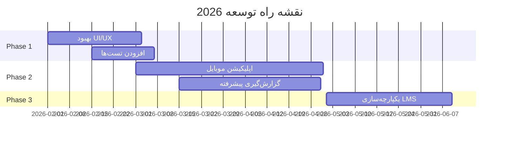

<div align="center">

# 🎓 سیستم آزمون و تحلیل SWOT با هوش مصنوعی

### پلتفرم هوشمند آموزشی با قابلیت تحلیل شخصیت و مشاوره شغلی

[](https://www.python.org/)
[](https://www.djangoproject.com/)
[](https://reactjs.org/)
[](https://www.typescriptlang.org/)
[](LICENSE)


[📖 مستندات](./docs/) • [🚀 شروع سریع](#-شروع-سریع) • [✨ ویژگی‌ها](#-ویژگیهای-کلیدی) • [🤝 مشارکت](#-مشارکت)

---

</div>

## 🎯 درباره پروژه

<table>
<tr>
<td width="50%">

### 📝 سیستم آزمون آنلاین
- مدیریت کامل آزمون‌ها
- انواع سوالات (چهارگزینه‌ای، تشریحی، صحیح/غلط)
- نمره‌دهی خودکار و دستی
- گزارش‌گیری پیشرفته

</td>
<td width="50%">

### 🧠 تحلیل SWOT با AI
- ارزیابی شخصیت دانشجویان
- تحلیل نقاط قوت و ضعف
- پیشنهادات شغلی هوشمند
- مشاوره مبتنی بر داده

</td>
</tr>
</table>

---

## ✨ ویژگی‌های کلیدی

<div align="center">

### 👨‍🎓 برای دانشجویان

</div>

```diff
+ شرکت در آزمون‌های آنلاین با رابط کاربری ساده و کاربرپسند
+ تحلیل SWOT شخصی با پاسخ به سوالات تخصصی
+ دریافت ارزیابی شخصیت جامع توسط هوش مصنوعی
+ پیشنهادات شغلی هوشمند بر اساس نقاط قوت و ضعف
+ رابط کاربری کاملاً فارسی با پشتیبانی RTL
+ مشاهده تاریخچه آزمون‌ها و تحلیل‌های قبلی
```

<div align="center">

### 👨‍🏫 برای اساتید

</div>

```diff
+ ایجاد و مدیریت آزمون‌ها با انواع سوالات مختلف
+ نمره‌دهی خودکار برای سوالات چهارگزینه‌ای
+ نمره‌دهی دستی برای سوالات تشریحی
+ مشاهده تحلیل‌های SWOT دانشجویان
+ ابزارهای مشاوره و راهنمایی مبتنی بر داده
+ داشبورد جامع با آمار و گزارش‌های تفصیلی
```

---

## 🚀 شروع سریع

### 📋 پیش‌نیازها

<table>
<tr>
<td align="center" width="33%">

<br><b>Python 3.8+</b>
</td>
<td align="center" width="33%">

<br><b>Node.js 16+</b>
</td>
<td align="center" width="33%">

<br><b>Ollama / OpenRouter</b>
</td>
</tr>
</table>

### ⚡ نصب سریع

<details open>
<summary><b>🔧 نصب Backend</b></summary>

```bash
# کلون پروژه
git clone https://github.com/DanixMP/Azmooneh.git
cd AzmoonehApp

# ایجاد محیط مجازی
python -m venv env

# فعال‌سازی محیط مجازی
# Windows:
env\Scripts\activate
# Linux/Mac:
source env/bin/activate

# نصب وابستگی‌ها
pip install -r requirements.txt

# تنظیم پایگاه داده
python manage.py migrate

# ایجاد سوالات SWOT
python manage.py populate_swot_questions

# ایجاد کاربر ادمین (اختیاری)
python manage.py createsuperuser
```

</details>

<details open>
<summary><b>🎨 نصب Frontend</b></summary>

```bash
# نصب وابستگی‌های Node.js
npm install

# یا با yarn
yarn install
```

</details>

<details open>
<summary><b>🤖 تنظیم هوش مصنوعی</b></summary>

**گزینه 1: استفاده از Ollama (محلی - رایگان)**

```bash
# نصب Ollama از https://ollama.ai
# دانلود مدل
ollama pull gemma2:2b

# کپی فایل تنظیمات
cp ai_config.example.json ai_config.json
```

**گزینه 2: استفاده از OpenRouter (ابری)**

```json
// در فایل ai_config.json
{
  "provider": "openrouter",
  "api_key": "YOUR_API_KEY_HERE",
  "model": "qwen/qwen-2.5-7b-instruct"
}
```

</details>

### 🎬 اجرای پروژه

```bash
# Terminal 1: اجرای Backend
python manage.py runserver

# Terminal 2: اجرای Frontend  
npm run dev
```

<div align="center">

### 🌐 دسترسی به سیستم

| سرویس | آدرس | توضیحات |
|:---:|:---:|:---:|
| 🎨 **Frontend** | [http://localhost:5173](http://localhost:5173) | رابط کاربری اصلی |
| 🔧 **Backend API** | [http://localhost:8000](http://localhost:8000) | API سرور |
| ⚙️ **Admin Panel** | [http://localhost:8000/admin](http://localhost:8000/admin) | پنل مدیریت Django |

</div>

---

## 📚 مستندات کامل

<div align="center">

| 📄 سند | 📝 توضیحات | 🔗 لینک |
|:---:|:---|:---:|
| **مقدمه** | آشنایی کامل با سیستم و قابلیت‌ها | [📖](./docs/01-introduction.md) |
| **معماری** | ساختار فنی و طراحی سیستم | [🏗️](./docs/02-architecture.md) |
| **راهنمای نصب** | مراحل نصب گام به گام | [⚙️](./docs/03-installation.md) |
| **راهنمای استفاده** | نحوه استفاده از تمام قابلیت‌ها | [📱](./docs/04-usage.md) |
| **API مستندات** | مستندات کامل API endpoints | [🔌](./docs/05-api-docs.md) |
| **تحلیل AI** | نحوه کار هوش مصنوعی | [🤖](./docs/06-ai-analysis.md) |
| **استقرار** | راهنمای استقرار Production | [🚀](./docs/07-deployment.md) |

</div>

---

## 🛠️ تکنولوژی‌ها

<div align="center">

### Backend Stack


### Frontend Stack


### AI & ML


</div>

---

## 📊 معماری سیستم

<div align="center">

### 🔄 جریان داده

</div>

```
┌─────────────────────────────────────────────────────────────┐
│                    Frontend (React/TS)                      │
│  ┌──────────────┐  ┌──────────────┐  ┌──────────────┐     │
│  │ Student View │  │ Professor    │  │ SWOT Analysis│     │
│  │              │  │ Dashboard    │  │ Component    │     │
│  └──────────────┘  └──────────────┘  └──────────────┘     │
└────────────────────────┬────────────────────────────────────┘
                         │ REST API (JSON)
┌────────────────────────▼────────────────────────────────────┐
│                    Backend (Django)                         │
│  ┌──────────────┐  ┌──────────────┐  ┌──────────────┐     │
│  │ Exam Views   │  │ SWOT Views   │  │ Auth Views   │     │
│  └──────┬───────┘  └──────┬───────┘  └──────┬───────┘     │
│         │                  │                  │              │
│  ┌──────▼───────┐  ┌──────▼───────┐  ┌──────▼───────┐     │
│  │ Exam Models  │  │ SWOT Models  │  │ User Models  │     │
│  └──────────────┘  └──────┬───────┘  └──────────────┘     │
│                            │                                 │
│                     ┌──────▼───────┐                        │
│                     │  AI Service  │                        │
│                     └──────┬───────┘                        │
└────────────────────────────┼────────────────────────────────┘
                             │
              ┌──────────────┴──────────────┐
              │                             │
    ┌─────────▼────────┐        ┌──────────▼─────────┐
    │   Database       │        │   AI Provider      │
    │   (SQLite)       │        │   (Ollama/Router)  │
    └──────────────────┘        └────────────────────┘
```

---

## 🧪 تست و کیفیت کد

<div align="center">

| نوع تست | دستور | توضیحات |
|:---:|:---|:---|
| 🔧 **Backend Tests** | `python manage.py test` | تست‌های واحد Django |
| 🤖 **AI Service** | `python test_new_ai.py` | تست سرویس هوش مصنوعی |
| 🎨 **Frontend Tests** | `npm run test` | تست کامپوننت‌های React |
| 📊 **Coverage** | `coverage run --source='.' manage.py test` | گزارش پوشش تست |

</div>

```bash
# اجرای تمام تست‌ها
python manage.py test

# تست با جزئیات بیشتر
python manage.py test --verbosity=2

# تست یک اپلیکیشن خاص
python manage.py test exams
python manage.py test swot
```

---

## 🔐 امنیت

<table>
<tr>
<td width="50%">

### 🔒 احراز هویت
- **JWT Token Authentication**
- Session Management
- Password Hashing (PBKDF2)
- Secure Cookie Handling

</td>
<td width="50%">

### 🛡️ مجوزها
- **Role-Based Access Control**
- Professor/Student Permissions
- API Endpoint Protection
- Object-Level Permissions

</td>
</tr>
<tr>
<td width="50%">

### 🔑 حفاظت از داده
- SQL Injection Prevention
- XSS Protection
- CSRF Token Validation
- Secure Data Encryption

</td>
<td width="50%">

### 📡 امنیت شبکه
- CORS Configuration
- HTTPS Ready
- Rate Limiting
- Input Validation

</td>
</tr>
</table>

---

## 📈 عملکرد و مقیاس‌پذیری

<div align="center">

| معیار | مقدار | توضیحات |
|:---:|:---:|:---|
| ⚡ **تحلیل AI** | 5-10 ثانیه | بسته به مدل و سخت‌افزار |
| 🚀 **نمره‌دهی خودکار** | < 1 ثانیه | پردازش فوری |
| 👥 **کاربران همزمان** | 500+ | با تنظیمات پیش‌فرض |
| 💾 **حجم دیتابیس** | قابل توسعه | SQLite/PostgreSQL |
| 📊 **API Response Time** | < 200ms | میانگین پاسخ‌دهی |

</div>

### بهینه‌سازی‌های اعمال شده

```python
# Caching Strategy
- Django Cache Framework
- Query Optimization
- Database Indexing
- Static File Compression

# Performance Tips
- Use PostgreSQL for Production
- Enable Redis for Caching
- Configure Gunicorn Workers
- Setup CDN for Static Files
```

---

## 🤝 مشارکت در پروژه

<div align="center">

### ما از مشارکت شما استقبال می‌کنیم! 🎉

</div>

### 📝 راهنمای مشارکت

```bash
# 1. Fork کردن پروژه
# کلیک روی دکمه Fork در GitHub

# 2. کلون کردن Fork شده
git clone https://github.com/DanixMP/Azmooneh.git
cd Azmooneh

# 3. ایجاد Branch جدید
git checkout -b feature/amazing-feature

# 4. اعمال تغییرات
git add .
git commit -m "Add: توضیحات تغییرات"

# 5. Push کردن به GitHub
git push origin feature/amazing-feature

# 6. ایجاد Pull Request
# از طریق رابط GitHub
```

### 🎯 راهنمای Commit Messages

```
feat: اضافه کردن قابلیت جدید
fix: رفع باگ
docs: بروزرسانی مستندات
style: تغییرات ظاهری
refactor: بازنویسی کد
test: اضافه کردن تست
chore: تغییرات عمومی
```

### 🐛 گزارش باگ

برای گزارش باگ، لطفاً موارد زیر را ذکر کنید:
- توضیحات مشکل
- مراحل بازتولید
- رفتار مورد انتظار
- اسکرین‌شات (در صورت امکان)
- محیط (OS، Browser، نسخه Python)

---

## 📝 لایسنس

<div align="center">

این پروژه تحت لایسنس **MIT** منتشر شده است.

[](LICENSE)

برای اطلاعات بیشتر، فایل [LICENSE](LICENSE) را مطالعه کنید.

</div>

---

## 📞 پشتیبانی و ارتباط

<div align="center">

### 💬 راه‌های ارتباطی

</div>

<table>
<tr>
<td align="center" width="33%">

<br>
<b>گزارش مشکلات</b>
<br>
<a href="https://github.com/DanixMP/Azmooneh/issues">ایجاد Issue</a>
</td>
<td align="center" width="33%">

<br>
<b>مستندات</b>
<br>
<a href="./docs/">مطالعه مستندات</a>
</td>
<td align="center" width="33%">

<br>
<b>پرسش و پاسخ</b>
<br>
<a href="https://github.com/DanixMP/Azmooneh/discussions">بحث و گفتگو</a>
</td>
</tr>
</table>

### 🆘 دریافت کمک

1. 📖 **مستندات را بررسی کنید** - اکثر سوالات در مستندات پاسخ داده شده‌اند
2. 🔍 **جستجو در Issues** - شاید سوال شما قبلاً پرسیده شده باشد
3. 💬 **ایجاد Issue جدید** - برای مشکلات و سوالات جدید
4. 🤝 **مشارکت کنید** - کمک به بهبود پروژه

---

## 🎓 نمونه‌های استفاده

<details>
<summary><b>📝 ایجاد آزمون جدید</b></summary>

```python
# در Django shell یا views
from exams.models import Exam, Question

# ایجاد آزمون
exam = Exam.objects.create(
    title="آزمون پایتون پیشرفته",
    description="آزمون جامع برنامه‌نویسی پایتون",
    duration_minutes=60,
    professor=professor_user,
    total_score=100
)

# اضافه کردن سوال
question = Question.objects.create(
    exam=exam,
    text="کدام گزینه درست است؟",
    question_type="multiple_choice",
    score=10
)
```

</details>

<details>
<summary><b>🧠 تحلیل SWOT با AI</b></summary>

```python
# تست سرویس AI
from swot.ai_service import AIService

# ایجاد نمونه سرویس
ai_service = AIService()

# تحلیل پاسخ‌های دانشجو
analysis = ai_service.analyze_swot(
    student_answers={
        "strengths": ["مهارت برنامه‌نویسی", "کار تیمی"],
        "weaknesses": ["مدیریت زمان"],
        "opportunities": ["یادگیری AI"],
        "threats": ["رقابت بازار کار"]
    }
)

print(analysis)
```

</details>

<details>
<summary><b>🔌 استفاده از API</b></summary>

```javascript
// ورود به سیستم
const login = async () => {
  const response = await fetch('http://localhost:8000/api/accounts/login/', {
    method: 'POST',
    headers: { 'Content-Type': 'application/json' },
    body: JSON.stringify({
      username: 'student1',
      password: 'password123'
    })
  });
  const data = await response.json();
  localStorage.setItem('token', data.access);
};

// دریافت لیست آزمون‌ها
const getExams = async () => {
  const response = await fetch('http://localhost:8000/api/exams/', {
    headers: {
      'Authorization': `Bearer ${localStorage.getItem('token')}`
    }
  });
  return await response.json();
};
```

</details>

---

## 🌟 ویژگی‌های آینده

<div align="center">

### نقشه راه توسعه

</div>

<table>
<tr>
<td width="50%">

### 📱 نسخه 2.0
- [ ] اپلیکیشن موبایل (React Native)
- [ ] پشتیبانی از PWA
- [ ] نوتیفیکیشن Push
- [ ] حالت آفلاین

</td>
<td width="50%">

### 📊 نسخه 2.5
- [ ] گزارش‌گیری پیشرفته
- [ ] داشبورد آماری
- [ ] نمودارهای تعاملی
- [ ] Export به PDF/Excel

</td>
</tr>
<tr>
<td width="50%">

### 🔗 نسخه 3.0
- [ ] یکپارچه‌سازی با LMS
- [ ] API عمومی
- [ ] Webhook Support
- [ ] SSO Authentication

</td>
<td width="50%">

### 🌍 نسخه 3.5
- [ ] پشتیبانی چندزبانه
- [ ] تحلیل‌های آماری ML
- [ ] Chatbot هوشمند
- [ ] Video Proctoring

</td>
</tr>
</table>

### 🎯 اولویت‌های فعلی



---

## 📊 آمار پروژه

<div align="center">


</div>

<table>
<tr>
<td align="center" width="25%">

<br><b>15,000+</b>
<br>خطوط کد
</td>
<td align="center" width="25%">

<br><b>30+</b>
<br>کامپوننت React
</td>
<td align="center" width="25%">

<br><b>25+</b>
<br>API Endpoint
</td>
<td align="center" width="25%">

<br><b>7</b>
<br>فایل مستندات
</td>
</tr>
</table>

### 📈 آمار توسعه

```
Backend (Python/Django)    ████████████░░░░░░░░  60%
Frontend (React/TS)        ███████████████░░░░░  75%
Documentation              ████████████████████  100%
Testing                    ████████░░░░░░░░░░░░  40%
AI Integration             ███████████████░░░░░  75%
```

---

<div align="center">

## 🎉 تشکر ویژه

### از تمام مشارکت‌کنندگان این پروژه سپاسگزاریم

[](https://github.com/DanixMP/Azmooneh/graphs/contributors)
[](https://github.com/DanixMP/Azmooneh/stargazers)
[](https://github.com/DanixMP/Azmooneh/network/members)
[](https://github.com/DanixMP/Azmooneh/issues)

---

### ساخته شده با ❤️ برای آموزش بهتر

**Azmooneh** - سیستم هوشمند آزمون و تحلیل شخصیت

[⬆ بازگشت به بالا](#-سیستم-آزمون-و-تحلیل-swot-با-هوش-مصنوعی)

</div>